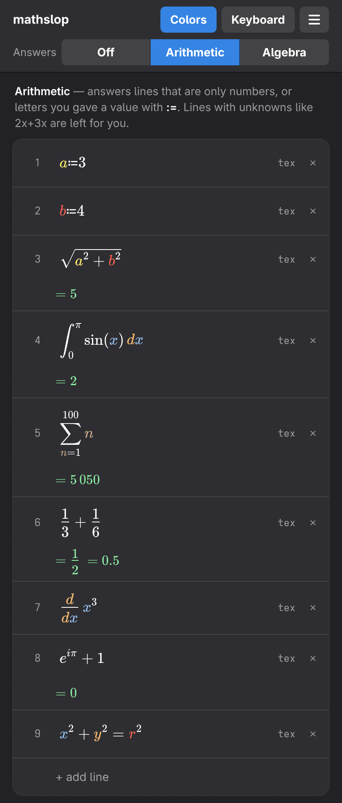

I'm trying to relearn algebra because it's been 20 years, and I wanted a sidebar for my Khan Academy lessons that's easier than trying to draw with a mouse or type out expressions/equations with normal ascii, and I didn't want to get distracted from math lessons coding up this extension, so I slopped this out real fast. 
  
Use it or don't.  

Dual licensed as MIT and WTFPL - see `LICENSE`.
